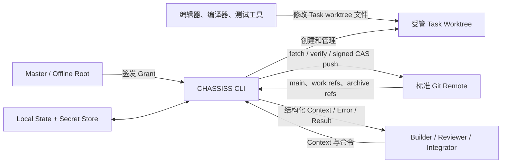
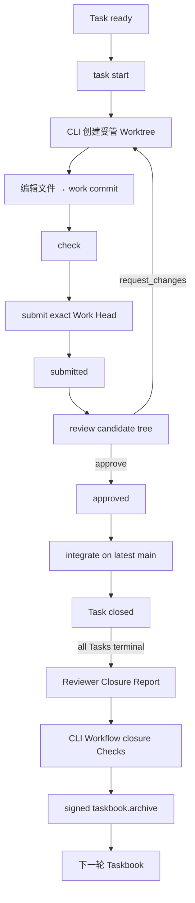
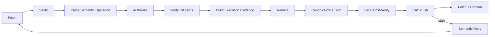

# CHASSISS v1 整体架构

## 1. 目标

CHASSISS 是一个以 Git 为共享账本、由 CLI 执行全部受支持 Git 工作流的多
Agent 项目协议。

它必须让一个只取得以下信息的新 Agent 重建当前项目：

```text
Git repository
+ Project ID
+ Root fingerprint
+ minimum trusted checkpoint
+ 自己的本地 private-key handle
```

新 Agent 必须能独立验证：

- Project Genesis 与 Root；
- main first-parent Transition chain；
- 当前 State；
- 当前 Grant 与 Capability；
- 当前 Architecture、活动 Taskbook 与 frozen Task Contract；
- Attempt、Review 和 Integration；
- 自己当前可以执行的 CLI Action。

系统不依赖原开发机器、数据库、控制服务或第三方 Git 平台。

## 2. 架构原则

```text
Git 保存共享事实
State 保存当前投影
Architecture 保存跨工作流架构
Taskbook 保存单轮工作流合同
CLI 管理 Git 并解释协议
父 State 决定权限
Reducer 生成唯一 next State
签名证明行动者
本地状态保存秘密与 anti-rollback anchor
```

CLI 是唯一受支持的 Git writer，但不是信任根。信任来自：

```text
out-of-band Root fingerprint
+ verified Git ancestry
+ Git SSH signature
+ 父 State 中的 Root/Grant
+ Capability、Scope 与 Limits
+ deterministic Reducer
```

## 3. 系统边界



外部编辑器可以改文件内容，不能改变 Git object、index、ref、branch、
worktree registry、config 或 remote。所有这些行为由 CLI 执行。

## 4. 权威共享模型

### 4.1 唯一权威主线

```text
refs/heads/main
```

main 的 first-parent history 是权威 Transition ledger。第二 parent 只用于
Integration 引入 exact Work Head，不参与 State Transition 顺序。

### 4.2 权威文件

```text
.chassiss/state.json
docs/architecture.yaml
docs/taskbook.yaml
docs/taskbooks/archive/<taskbook-id>.yaml
```

`.chassiss/state.json` 是动态当前投影。`docs/architecture.yaml` 是跨工作流
持续演进的当前架构合同。`docs/taskbook.yaml` 只表示当前一轮需求的活动
Taskbook，包含本轮 Outcome、Workflow Checks、Requirements、Constraints 与
全部 Task Contract。
当本轮全部 Task terminal、工作流级机械 Checks 通过并由有权 Reviewer 完成
整体验收后，CLI 把它原样移动到
`docs/taskbooks/archive/<taskbook-id>.yaml`，清空当前 Task 投影；下一轮需求
创建新的 Taskbook。

源码和普通项目文档也是 Git tree 的一部分，但不具有协议字段语义，除非被
Architecture/Taskbook 引用或进入 Task `writes`。

### 4.3 受管 refs

```text
refs/heads/main
refs/heads/chassiss/work/<task-id>/<actor-id>
refs/heads/chassiss/transition/<action>/<operation-id>
refs/chassiss/archive/<task-id>/<attempt-hex>
```

Work Ref 承载候选成果；Transition Ref 承载尚未进入 main 的签名提案；Archive
Ref 保持已终止 Attempt 可达。

## 5. 组件

| 组件 | 职责 |
|---|---|
| CLI Command Layer | 参数解析、人类/JSON 输出和安全确认 |
| Context Engine | 从 verified State/Architecture/Taskbook 生成局部上下文与 available actions |
| Git Workspace Manager | init、clone、remote、branch、worktree、index、commit、ref |
| Protocol Verifier | Genesis、signature、Trailer、topology、history、checkpoint |
| Operation Builder | 生成稳定 Semantic Operation 与 Operation ID |
| Evidence Builder | 为每次 CAS 尝试生成 exact Execution Evidence |
| Authorization Engine | 验证 Root/Grant、Capability、Scope 和 Limits |
| Contract Engine | Architecture/Taskbook YAML subset、Task/Requirement/Resource 解析与图查询 |
| Reducer | 从父 State、Semantic Operation、Execution Evidence 和 verified Git facts 生成唯一 next State |
| Candidate Engine | 计算 Review/Integration candidate tree 与 drift |
| Check Runner | 以 argv/cwd/timeout 执行 frozen Task 与 Workflow CheckSpec |
| Local State Store | trust anchor、checkpoint、identity handle、pending Operation、worktree |
| Secret Signer | 调用本地 Ed25519 private-key handle 进行 SSH signing |

任何可删除的索引、Dashboard 或搜索服务都位于组件外层，不能成为验证依赖。

## 6. 主工作流



Task 依赖、Path scope 与 Architecture Resource Graph 决定能否并行开始。
mainline 状态提交保持线性，实际编辑、检查和 Review 可以在不同受管 worktree
并行进行。

## 7. Mutation pipeline



所有 mutation 都执行该 pipeline。调用者不能提供任意 State patch，也不能
跳过同步、验证、签名或 CAS。

## 8. State 与历史

State 只保存：

- Project ID、当前 Architecture blob 与可选活动 Taskbook blob；
- 当前 Root 与有效 Grants；
- 活动 Taskbook 中每个 Task 的 phase；
- 非终态 Task 验证下一次转换所需的 actor/base/frozen contract；
- 当前 Attempt 与当前 Review 的必要投影。
- 可选的轻量 Review/失败索引，用于从签名 history 定位完整审计记录。

State 不保存：

- Action history；
- revocation tombstone；
- 完整 historical Attempt/Review/Integration/失败报告；
- Operation ID window；
- changed paths、metrics 或 Resource Graph；
- worktree、branch、remote、cache、lock 或 Session；
- private key、token、日志或费用。

缺失的历史事实从 Git first-parent Transition history 重建。
Grant Authority 仅来自 verified shared State/history；本地 identity 只保存
private-key handle，不另存 Grant object/discovery cache，并在每次命令中重新
发现匹配 Grant。

## 9. Taskbook 与架构

Architecture 是跨工作流的单一 YAML blob，至少包含 Module View，可以增加：

```text
API View
Schema View
Dependency View
Config View
```

所有 View 形成一张 stable ID 的有向无环 Resource Graph。活动 Taskbook 是
单轮工作流 YAML blob。Task 通过：

```text
depends_on
modules
writes
affects
```

声明顺序、文件边界与语义影响。Task start 同时冻结当前 Taskbook 与
Architecture blob。CLI 使用显式 ID 和 graph closure 提取 Context，不使用
向量检索参与协议判断。

## 10. Authority

Agent 在本地生成 Ed25519 key pair。Root 只接收 public key/Grant Request，并
通过 Root-signed `authority.grant-added` 把当前 Capability 写入 State。

Agent 不需要 Root 返回权威 Credential 文件。它 fetch main、验证 Root chain，
再用本地 public key fingerprint 找到匹配 Grant。

撤销从新 State 删除 Grant，历史保留在 Git。父 State 决定当前 Action 是否
有效，新 State 不能给产生自己的签名者扩权。

## 11. 并发与恢复

多个 Agent 可以同时编辑不同 Task。mainline mutation 使用 expected-parent
CAS。Operation ID 绑定稳定 Semantic Operation；每次 CAS 尝试绑定独立
Execution Evidence。CAS 明确失败后，CLI 只有在语义前置条件仍成立时才能在
同一 Operation ID 下重新生成 Evidence、reduce、签名并重试。push 结果未知时
必须先对账，禁止直接生成下一份 Evidence。

Operation ID 处理 push 成功但响应丢失的情况。minimum local checkpoint 防止
remote 回滚到历史上仍有合法签名的旧状态。

CLI 不维护共享 journal 或 project lock。pending Operation、process lock 和
worktree registry 都是本地数据。

## 12. 信任与强制

三层共同提供防护：

1. CLI 只生成规范 Git 对象和 State；
2. 每个接收者独立验证完整协议链；
3. 可选 remote hook/ref ACL 拒绝非法写入。

第三层不是协议正确性的前提。remote 即使被绕过，非法 main head 也不能通过
客户端 verifier。

## 13. v1 非目标

- 不兼容旧 `.chassis` 控制目录；
- 不模拟所有 Git 命令；
- 不提供第三方托管平台 Adapter；
- 不提供常驻调度器、Dashboard 或数据库；
- 不提供多 Reviewer、Waiver、Root recovery 或 delegation；
- 不对 token、费用、模型或 Provider receipt 形成共识；
- 不自动迁移、导入、裁剪或重写历史。
