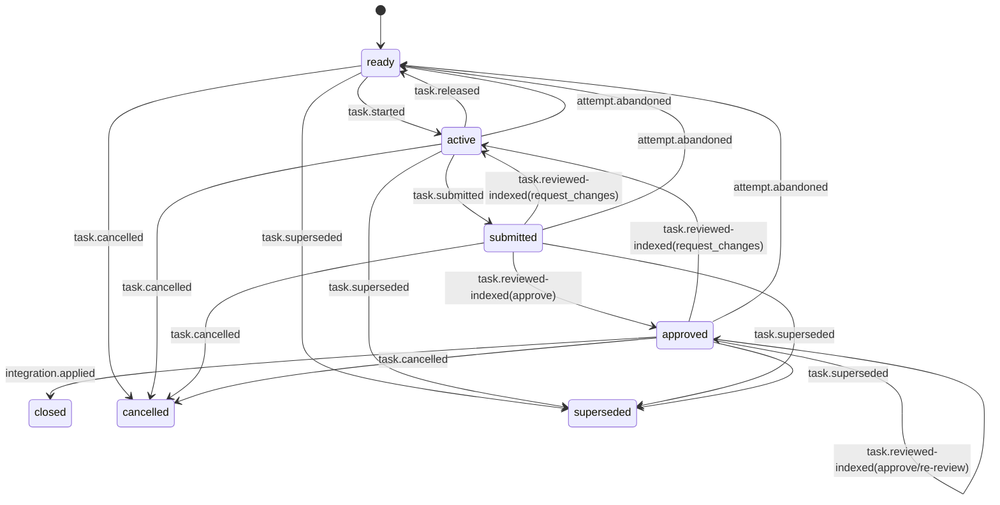

# State Model

## 1. 唯一保留规则

```text
state.json 只保存验证下一次转换所必需的当前投影。
```

路径固定为：

```text
.chassiss/state.json
```

State 由 CLI 和 Reducer 生成，禁止人工或 Agent 直接编辑。

## 2. 编码

- UTF-8；
- RFC 8785 JSON Canonicalization Scheme；
- exact canonical JSON bytes 后附一个 LF；
- 不允许 duplicate key、float、NaN、Infinity 或未知字段；
- `state_digest = SHA-256(exact state blob bytes)`；
- State 不包含自己的 digest、commit OID、sequence 或 previous digest。

模板见 `templates/state.json`。模板采用可读缩进；CLI 写入仓库前必须生成
canonical bytes。

## 3. 顶层字段

```json
{
  "audit": {},
  "authority": {},
  "project": {},
  "protocol": "chassiss/v1",
  "schema": "chassiss.state/v1",
  "tasks": {}
}
```

| 字段 | 必须 | 语义 |
|---|---|---|
| `protocol` | 是 | 固定 `chassiss/v1` |
| `schema` | 是 | 固定 `chassiss.state/v1` |
| `audit` | 否 | 历史报告/失败的轻量可解析索引；无条目时省略 |
| `project` | 是 | Project ID、当前 Architecture 与可选活动 Taskbook |
| `authority` | 是 | 当前 Root 与有效 Grants |
| `tasks` | 是 | Task 当前 progress projection |

v1 State 没有 `extensions`。

### 3.1 轻量 Audit Index

完整 Review Report、失败原因正文、Check Results 和签名证明只保存在
first-parent Transition history。State 的可选 `audit` 只保存 CLI 定位这些
记录所需的稳定摘要：

```json
{
  "failures": [
    {
      "actor": "agent-builder-1",
      "agent_grant_id": "GRT-BUILDER-01",
      "agent_key_id": "KEY-BUILDER-01",
      "changed_paths_digest": "sha256:...",
      "code": "AGENT_TEST_FAILURE",
      "operation_id": "OPR-...",
      "phase": "active",
      "summary": "Focused test failed.",
      "task": "TASK-001",
      "taskbook": "TASKBOOK-001",
      "work_head": "0123456789abcdef0123456789abcdef01234567",
      "work_tree": "0123456789abcdef0123456789abcdef01234567"
    }
  ],
  "reviews": []
}
```

Review index 绑定 Taskbook、Task、Attempt/Context/Report digest、Reviewer
Actor/Grant/Key/fingerprint、Verdict 与 Operation ID。失败 index 绑定失败
code/summary、Agent Grant/Key、Work Head/tree 与 changed-path digest。索引不
复制完整报告；`review show` 和 `attempt failures --operation` 从 verified
history 解析正文。未来归档/截断只能移动已完成索引，不能改变被签名历史。

## 4. Project

```json
{
  "architecture": {
    "blob_oid": "0123456789abcdef0123456789abcdef01234567",
    "path": "docs/architecture.yaml"
  },
  "id": "PRJ-EXAMPLE",
  "taskbook": {
    "blob_oid": "0123456789abcdef0123456789abcdef01234567",
    "id": "TASKBOOK-001",
    "path": "docs/taskbook.yaml"
  }
}
```

| 字段 | 规则 |
|---|---|
| `id` | Genesis 后不可改变；项目历史中唯一 |
| `architecture.path` | v1 固定 `docs/architecture.yaml` |
| `architecture.blob_oid` | 当前 main tree 中该路径的 exact Git blob OID |
| `taskbook.path` | v1 固定 `docs/taskbook.yaml` |
| `taskbook.id` | 当前活动 Taskbook ID；Project history 中不复用 |
| `taskbook.blob_oid` | 当前 main tree 中该路径的 exact Git blob OID |

`taskbook` 可以为 `null`，表示上一轮已经归档、下一轮尚未打开。此时
`docs/taskbook.yaml` 必须不存在且 `tasks` 必须为空。Architecture 始终存在。
Architecture/Taskbook update 同时改变 tree 中的文件与对应 `blob_oid`。

## 5. Authority

```json
{
  "grants": {},
  "root": {
    "key_id": "KEY-ROOT-01",
    "public_key": "ssh-ed25519 AAAA..."
  }
}
```

### 5.1 Root

| 字段 | 规则 |
|---|---|
| `key_id` | Project 历史中不复用 |
| `public_key` | 无 comment 的 canonical OpenSSH Ed25519 public key |

v1 不保存 Root private key、rotation、recovery 或 compromise cutoff。

### 5.2 Grant

`grants` 是以 Grant ID 为 key 的 mapping：

```json
{
  "GRT-BUILDER-01": {
    "actor": "agent-builder-1",
    "capabilities": [
      "task.start",
      "task.submit"
    ],
    "key_id": "KEY-BUILDER-01",
    "limits": {
      "max_active_tasks": 2,
      "max_changed_paths": 80,
      "mode": "bounded"
    },
    "public_key": "ssh-ed25519 AAAA...",
    "scope": {
      "resources": [
        "module:core"
      ],
      "tasks": [
        "TASK-*"
      ]
    }
  }
}
```

字段规则：

| 字段 | 规则 |
|---|---|
| `actor` | 项目内稳定 Actor ID；Profile/模型名不进入 |
| `key_id` | 对应 public key 的稳定 ID，历史不复用 |
| `public_key` | canonical Ed25519 OpenSSH public key |
| `capabilities` | 非空、排序、去重、只允许 v1 exact Capability |
| `scope.tasks` | 非空、排序、去重；exact/prefix/`*` |
| `scope.resources` | 非空、排序、去重；typed resource exact/type wildcard/`*` |
| `limits.mode` | `bounded` 或 `unbounded` |
| `max_active_tasks` | bounded 可选正整数 |
| `max_changed_paths` | bounded 可选正整数 |

`bounded` 至少包含一个位于 `[1, 2147483647]` 的整数 limit；未出现的维度
没有额外数字上限。`unbounded` 禁止出现两个数字 limit。

State 只保存当前有效 Grant。撤销后删除对应 entry；Grant ID 永不复用。

## 6. Task phase

```text
ready
active
submitted
approved
closed
cancelled
superseded
```

允许的稀疏字段：

| Phase | 必须字段 |
|---|---|
| `ready` | `phase` |
| `active` | `phase`、`actor`、`base`、`contract` |
| `submitted` | active 字段、`attempt` |
| `approved` | submitted 字段、`review` |
| `closed` | `phase` |
| `cancelled` | `phase` |
| `superseded` | `phase` |

`blocked: true` 可以出现在任何非终态 Task。`blocked: false` 禁止；resume 直接
删除字段。终态 Task 禁止 `blocked`。

Task ID 是 `tasks` mapping key，在 Project 历史中不复用。活动 Taskbook 中的
每个 Task 都必须存在于 State；新 Task 由 `taskbook.opened` 或
`taskbook.updated` 以 `ready` 加入。`taskbook.archived` 后整个 mapping 清空；
历史 Task 从 Transition history 和归档 Taskbook 重建。

## 7. Active fields

```json
{
  "actor": "agent-builder-1",
  "base": "0123456789abcdef0123456789abcdef01234567",
  "contract": {
    "architecture_blob": "0123456789abcdef0123456789abcdef01234567",
    "taskbook_blob": "0123456789abcdef0123456789abcdef01234567"
  },
  "phase": "active"
}
```

| 字段 | 语义 |
|---|---|
| `actor` | 当前 Task owner；Action signer Grant actor 必须匹配 |
| `base` | `task.started` 时的 verified main commit |
| `contract.architecture_blob` | start 时冻结的 Architecture exact blob |
| `contract.taskbook_blob` | start 时冻结的 Taskbook exact blob |

Project 当前 Architecture/Taskbook 后续变化不改变该 frozen Contract。
Actor 匹配只适用于 `task.release` 和 `task.submit`；其他 Action 使用各自的
Capability/Scope 规则，不从该字段推导隐藏角色。

## 8. Attempt

```json
{
  "evidence_digest": "sha256:...",
  "head": "0123456789abcdef0123456789abcdef01234567",
  "submitter_key_fingerprint": "SHA256:base64..."
}
```

| 字段 | 语义 |
|---|---|
| `head` | exact Work Commit OID |
| `evidence_digest` | Submission Evidence canonical digest |
| `submitter_key_fingerprint` | 签发 `task.submitted` 的 Ed25519 key fingerprint |

Tree、changed paths、metrics、Attempt digest 和 Work Ref 不重复进入 State；
CLI 从 Git objects 和 history 计算。

## 9. Review

```json
{
  "candidate_tree": "0123456789abcdef0123456789abcdef01234567",
  "context_digest": "sha256:...",
  "key_fingerprint": "SHA256:base64...",
  "key_id": "KEY-REVIEWER-01",
  "report_digest": "sha256:...",
  "review_main": "0123456789abcdef0123456789abcdef01234567",
  "reviewer": "agent-reviewer-1"
}
```

| 字段 | 语义 |
|---|---|
| `context_digest` | exact Review Context digest |
| `review_main` | 生成 candidate tree 的 verified main |
| `candidate_tree` | Review 通过的 hypothetical closed Integration tree |
| `reviewer` | Reviewer Actor |
| `key_id` | Reviewer key ID |
| `key_fingerprint` | Reviewer key fingerprint |
| `report_digest` | inline canonical Review Report digest |

`approved` 已隐含 verdict=approve，因此 State 不重复保存 verdict。完整 Report、
Check Results、Review Operation 和 Execution Evidence 保存在签名 Transition
message。

## 10. Phase transitions



Block/resume 是非终态上的正交转换，不改变 phase。

## 11. Reducer 稀疏化规则

- `task.started` 增加 actor/base/contract；
- `task.released` 的共享 Evidence 必须声明且证明 observed Work Head 等于
  base；worktree clean 只作本地 preflight；成功后删除 actor/base/contract；
- `attempt.abandoned` 先把完整失败记录写入签名 Operation、把轻量索引追加到
  `audit.failures`，再将 Task 稀疏化为 ready；
- `task.submitted` 增加 attempt；
- submitted/approved 上的 request_changes 删除 attempt/review，保留 active
  fields；
- submitted approve 增加 review；approved re-review 替换当前 review；
- Integration/cancel/supersede 删除除 phase 外全部 Task 字段；
- block 增加 `blocked: true`；
- resume 删除 `blocked`。
- `taskbook.archived` 只在全部 Tasks terminal、Closure Report 有效且全部
  Workflow Closure Check Results 通过 exact Context binding/all-pass 验证时
  清空 `tasks` 并令 `project.taskbook=null`。Check Results 只保留在签名
  Transition Evidence，不进入 next State。

Reducer 必须拒绝 phase 不允许的多余字段。

## 12. 明确不进入 State

```text
State/Transition sequence
previous/current State digest
current commit OID
Requirements、Architecture、Task Contract 正文
Task dependencies、writes、affects、Checks、change limits
完整 historical Attempt、Review、Integration
Review Report 正文
Grant revocation tombstone
Operation/Evidence 与 pending Operation（Audit Index 可保存定位用 Operation ID）
branch/ref/worktree/remote
changed paths、metrics、Resource Graph
cache、lock、PID、Session
private key、token、secret
time、费用、模型、Provider receipt
```
