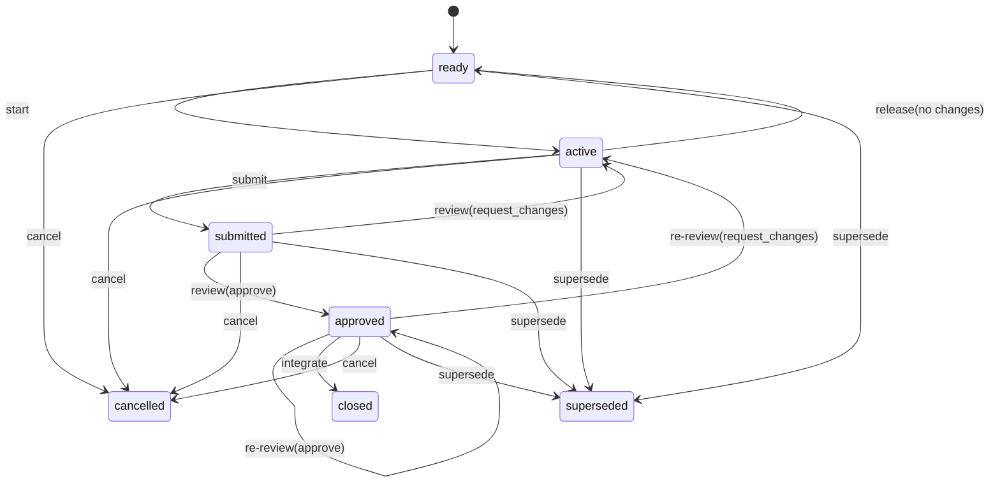

# Task Lifecycle、Review 与 Integration

## 1. 实体边界

```text
Task         唯一稳定工作实体
Attempt      当前不可变候选实现
Review       当前 Attempt 的单一签名证明
Integration  一次签名 Git Transition
```

Attempt、Review 和 Integration 不建立顶层 registry 或人工生命周期 ID。
历史从 Git Transition ledger 恢复。

## 2. Task 生命周期



任何非终态可以 block/resume。blocked Task 只允许 resume、cancel 或 supersede。

### 2.1 Action actor matrix

v1 不定义强制角色，只有 exact Capability/Scope：

| Action | Actor rule |
|---|---|
| `task.started` | signer Grant actor 成为 Task actor |
| Work Commit、`task.released`、`task.submitted` | signer actor 必须等于 Task actor |
| `task.blocked`、`task.resumed`、`task.cancelled` | 任意具有 exact Capability 和 Task/Resource scope 的 Grant |
| `task.reviewed-indexed` | 任意具有 `review.attest` 和 Scope 的 Grant；可以与 submitter 相同 |
| `integration.applied` | 任意具有 `integration.apply` 和 Scope 的 Grant |
| `task.superseded` | Root 或具有 `task.supersede` 和 Scope 的 Grant |

CLI 对同 actor、同 key 或同本地 principal 完成 Review 必须产生醒目 warning，
但不得仅因此拒绝合法 Action。部署层仍应该优先使用不同 Actor/key/Session，
也允许 Master Agent 授权自己的 Reviewer 子 Agent。

## 3. Start

`task.started` 必须验证：

- phase=ready 且未 blocked；
- signer Grant actor 与目标 actor 相同；
- `task.start` Capability；
- Task/Resource scope；
- 所有 `depends_on` 已 closed；
- 与其他占用 Task 无 Path/Resource conflict；
- Grant `max_active_tasks`；
- 当前 Taskbook/Architecture schema 与引用；
- CLI 能创建受管 branch/worktree。

结果：

```text
phase=active
actor=Grant.actor
base=current verified main
contract.taskbook_blob=current Taskbook blob
contract.architecture_blob=current Architecture blob
```

## 4. Work

CLI 在 frozen base 上建立受管单 parent Work Branch。Agent 可以编辑文件，
`work commit`：

1. 检查 protected paths；
2. 检查 actual changed paths 是 frozen `writes` 子集；
3. 由 CLI staging；
4. 使用 Task Actor Ed25519 key 创建 SSH-signed Work Commit；
5. 更新本地受管 branch。

每次尝试使用 `refs/heads/chassiss/work/<task>/<base-prefix>/<actor>` 与
`.../<project>/<task>/<base-prefix>/<actor>` 临时 worktree path，避免同一
Task 的不同尝试复用目录或 ref。验证器继续只读接受早期 v1 的
`.../<task>/<actor>` Work Ref。

Work Commit 不产生 State Action。Work Branch 不允许 merge、rebase、reset、
cherry-pick 或 force-push。

`submit` 必须验证 frozen base 到 Work Head 的每个 Work Commit：

- 恰好一个 parent，形成连续线性链；
- Git SSH signature 使用 Ed25519；
- signer fingerprint 在 verified Project history 中映射到当前 Task Actor；
- 每个 parent→child changed-path set 都是 frozen `writes` 子集；
- 每步 tree 都不修改 protected paths。

这些签名提供 provenance；最终内容 Authority 仍由当前有效 Grant 签发的
`task.submitted` 承担。

## 5. Release、Block、Cancel、Supersede

### 5.1 Release

`task.released` 只允许：

- phase=active；
- 未 blocked；
- Work tree clean；
- Work Head 恰好等于 frozen base；
- signer actor 等于 Task actor。

它删除 actor/base/contract，使 Task 回到 ready。存在实际工作时必须继续
submit，或由授权者 cancel/supersede，不能用 release 隐藏工作。

Master 调度的临时 Agent 失败时不得先删除 worktree。Root 使用
`attempt abandon` 把 `chassiss.attempt-failure/v1` 正文和 observed Work
Head/tree 写入签名 Transition，只把轻量索引追加到 State，然后将 Task
恢复为 ready 并强制清理 worktree/Work Ref。之后 Master revoke 临时 Grant
并删除临时 Key。失败正文通过 `attempt failures --operation` 从 verified
history 读取。

### 5.2 Block

`task.blocked` 的 Semantic Operation 必须含 reason。它增加 `blocked: true`，保留当前
phase 和资源占用。

`task.resumed` 删除 blocked，并重新验证依赖、Grant、Scope、Taskbook、
Attempt/Review 与资源条件。

### 5.3 Cancel

`task.cancelled` 是普通终止，Semantic Operation 必须含 reason。terminal State 只保留
`phase=cancelled`。

### 5.4 Supersede

`task.superseded` 是 Master 紧急停止或方向替换，Authority 必须为 Root 或具备
`task.supersede` 的受控 Grant。Semantic Operation 必须含 reason，可以含 replacement Task
ID。非 null replacement 必须是当前 Taskbook 中存在且不同于目标的 Task。
terminal State 只保留 phase；理由和替代关系在 Git history。

`cancelled` 与 `superseded` 都是完整 terminal disposition。Taskbook archive
不强制为它们创建 replacement、补做 Task 或转换成 `closed`；最终
Reviewer 必须在签名 Closure Report 中逐项写明并确认接受。

有已提交 Attempt 时，cancel/supersede 必须使用一次 atomic push 同时
create-only 建立规范 Archive Ref 并 CAS 推进 main。任一 ref 失败则两者都不得
改变。

## 6. Submit

`submit <task>` 必须：

1. 隐式 sync/verify；
2. 确认 Task active、未 blocked、actor 匹配；
3. 确认 worktree clean；
4. 验证 Work chain 基于 frozen base；
5. 计算 actual changed paths；
6. 拒绝 protected path 与 `writes` 越界；
7. 验证 effective `max_changed_paths`；
8. 在 exact Work Head 上运行 frozen Checks；
9. 再次确认 Work Head 未改变且 worktree clean；
10. fast-forward publish Work Ref；
11. 构造 Submission Evidence；
12. 签名 `task.submitted` 并 CAS push main。

`writes: []`、`checks: []` 和 Work Head 恰好等于 frozen base 都合法。此时
Work chain 可以包含零个 Work Commit；Submission Evidence 仍绑定 base/head/
tree，Review 与 Integration 仍完整执行。由于 start/submit/review 已推进 main，
Integration 的 first parent 与作为 second parent 的 frozen base 仍是两个不同
commit。

Submission Evidence canonical object：

```json
{
  "architecture_blob": "<blob>",
  "base": "<commit>",
  "changed_paths_count": 12,
  "changed_paths_digest": "sha256:...",
  "check_results": [],
  "head": "<commit>",
  "schema": "chassiss.submission-evidence/v1",
  "submitter": {
    "actor": "agent-builder-1",
    "key_fingerprint": "SHA256:..."
  },
  "task": "TASK-001",
  "taskbook_blob": "<blob>",
  "tree": "<tree>"
}
```

State 保存 `head`、Evidence digest 与 submitter key fingerprint。

Canonical Attempt object：

```json
{
  "architecture_blob": "<blob>",
  "base": "<commit>",
  "evidence_digest": "sha256:...",
  "head": "<commit>",
  "schema": "chassiss.attempt/v1",
  "task": "TASK-001",
  "taskbook_blob": "<blob>"
}
```

`attempt_digest` 使用 `attempt` domain-separated SHA-256。Git ref 不能包含
digest 的 `sha256:` 冒号，因此 Archive Ref 使用其 64 lowercase hex 部分：

```text
refs/chassiss/archive/<task-id>/<attempt-hex>
```

## 7. Check Result

每次执行 Check 前先构造独立的 canonical Check Execution Context：

```json
{
  "architecture_blob": "<blob>",
  "check_id": "CHECK-001",
  "check_spec_digest": "sha256:...",
  "head": "<commit>",
  "phase": "submission",
  "schema": "chassiss.check-execution-context/v1",
  "task": "TASK-001",
  "taskbook_blob": "<blob>",
  "tree": "<tree>"
}
```

exact 字段如上。`phase` 只允许
`submission|review|integration|workflow-closure`。前三个阶段的 `task` 必须
是目标 Task ID，Context 使用 frozen Task Contract/Architecture blobs；
`workflow-closure` 的 `task` 必须为 JSON `null`，Context 使用 active
Taskbook 的 `workflow.checks`、current Architecture blob 和 archive
Transition exact parent 的 `head/tree`。
`check_spec_digest` 是 frozen CheckSpec parsed model 的 `check-spec` domain
digest。Context 使用 `check-execution-context` domain digest。

Check Result exact 结构：

```json
{
  "check_id": "CHECK-001",
  "context_digest": "sha256:...",
  "exit_code": 0,
  "status": "pass"
}
```

`status`：

```text
pass
fail
error
```

timeout、无法启动和执行环境错误使用 `error`。目标阶段的 Check 必须全部 pass
才能 submit、approve、integrate 或 archive。

Result 是 closed object，只允许 `check_id`、`context_digest`、`exit_code`、
`status`。`pass` 要求 `exit_code=0`；`fail` 要求非零 signed 32-bit integer；
`error` 要求 `exit_code=null`。每个 frozen CheckSpec 恰好对应一个 Result，并
按目标 Task Contract `checks` 或 `workflow.checks` 顺序排列；missing、
duplicate、unknown Check ID 或 status/exit mismatch 都拒绝。完整 array使用
`check-results` domain digest。

完整 stdout/stderr 在本地，不进入 State、Taskbook 或外部权威引用。
Check Result 位于签名 Execution Evidence。历史 verifier 必须重算 exact
Context/digest、验证 CheckSpec 与 Result schema/签名绑定，但不重新执行命令，
也不声称证明历史机器的环境或 exit code；Result 是 Action signer 对该次执行的
签名 attestation。Submission、Review、Integration 与 Workflow Closure 各自
重新执行，不能复用其他阶段的 attestation。

## 8. Review Context

CLI 在 Review 时的 latest verified main 上计算：

```json
{
  "artifact_tree": "<tree>",
  "architecture_blob": "<blob>",
  "attempt_head": "<commit>",
  "candidate_tree": "<tree>",
  "check_results": [],
  "requires_closure": [],
  "review_main": "<commit>",
  "schema": "chassiss.review-context/v1",
  "task": "TASK-001",
  "task_base": "<commit>",
  "taskbook_blob": "<blob>"
}
```

candidate tree 使用规范的 tree overlay，并包含 hypothetical
`integration.applied` 后的 closed State。它不等于随后
`task.reviewed-indexed(approve)` 的 approved State tree；Reviewer
绑定的是若立即集成
将进入 main 的完整结果。

首次 Review 的前置 phase 是 submitted。Mainline relevant drift 后允许对
approved Task 的同一 exact Attempt 产生新 Review Context；这称为 re-review，
不创建第二个 Review 实体。

Review Transition 的 CAS retry 使用第 13 节同一 path/resource drift 算法比较
已准备 Context 的 `review_main` 与新 parent。只有 unrelated drift 且
Attempt/artifact/frozen contracts/Report 语义不变时，CLI 才能在同一 Semantic
Operation 下重算 Context、Checks 和 Evidence；relevant/unknown drift 返回
`CHS_REVIEW_CONTEXT_STALE`，要求 Reviewer 重新 prepare/确认。

## 9. Reviewer 独立性建议

CLI 必须计算并显示：

```text
same_actor = reviewer.actor == attempt.actor
same_key = reviewer.key_fingerprint == attempt.submitter_key_fingerprint
```

任一为 true 时产生 warning，但 Review 仍可成为协议有效事实。Session、设备、
模型、Provider 和“是否为 Master Agent 的子 Agent”不参与协议判断。

## 10. Review Report

Review Report 是 Semantic Operation 中的 canonical inline object，最大
65,536 bytes。

固定字段：

```text
schema = chassiss.review-report/v1
verdict
summary
results
findings
reviewer_attention_responses
```

四个结果：

```text
requirements = pass | fail
contract = pass | fail
architecture = conformant | nonconformant
integration = pass | fail
```

Finding：

```text
severity = blocking | advisory
category = requirements | contract | architecture | integration | check
summary
paths
resources
```

每个 `reviewer_attention_responses` entry 包含 frozen Contract 中的原
`attention` 文本与 Reviewer 的 `response`。所有 frozen reviewer attention
都必须有对应 entry。

`reviewer_attention_responses` 保持 frozen Contract 顺序；`findings` 保持
Reviewer 给出的顺序。Finding 的 `paths`、`resources` 必须排序、去重。Check
Results 属于 Execution Evidence，不进入稳定 Report。

Report、`results`、Finding 和 attention response 都是 closed object。Finding
exact 字段为 `severity`、`category`、`summary`、`paths`、`resources`；
attention response exact 字段为 `attention`、`response`。所有 summary/response
必须是非空 string，paths 必须满足协议 Path grammar，resources 必须引用
frozen Architecture 中存在的 ID。Report `verdict` 必须与 Operation payload
顶层 verdict 相同。未知字段、duplicate attention、顺序不匹配和超过大小限制
都拒绝。

`approve` 必须：

- 四个结果全部通过；
- required Checks 全部 pass；
- 没有 blocking Finding；
- Report/Context/Attempt digests 全部一致。

v1 没有 Waiver 或 minor deviation 放行。发现架构缺口时必须
`request_changes`，再通过 Taskbook update/replacement Task 处理。

## 11. Request changes

```text
submitted | approved
→ task.reviewed-indexed(verdict=request_changes)
→ active
```

Reducer 删除当前 Attempt/Review，保留 actor/base/frozen contract。Report、
target Attempt、Reviewer 和签名在 history。Actor 在同一 Work Branch 追加
CLI Work Commit 后重新 submit。

## 12. Approve

```text
submitted | approved
→ task.reviewed-indexed(verdict=approve)
→ approved
```

submitted approve 创建当前 Review；approved re-review 原子替换当前 Review。
State 保存新 Context digest、review_main、candidate tree、Reviewer identity/key
和 Report digest，并向 `audit.reviews` 追加轻量历史索引。完整 Report 只在
签名 Transition 中。一个 Attempt 始终只有一个当前 Review。

## 13. Mainline Drift

```text
drift = review_main..current_integration_parent 的新增 first-parent history
```

Integration 始终重新计算 candidate tree。Drift 只分：

```text
unrelated
relevant
```

Drift Classification canonical object：

```json
{
  "affected_resources": [],
  "changed_paths_digest": "sha256:...",
  "classification": "unrelated",
  "commit_range_digest": "sha256:...",
  "integration_parent": "<commit>",
  "reasons": [],
  "review_main": "<commit>",
  "schema": "chassiss.drift-classification/v1",
  "task": "TASK-001"
}
```

`commit_range_digest` 绑定从 review_main 之后到 integration parent 的有序
first-parent commit OID array；`changed_paths_digest` 绑定规范排序、去重后的
repo-relative path array。Verifier 必须从 Git objects 重算，不能信任
Integrator 输入。每个 `reasons` entry 使用：

```json
{
  "kind": "path|resource|contract|check|candidate-conflict|unknown",
  "value": "<stable-id-or-summary>"
}
```

只有下列条件全部成立才能判 unrelated：

- exact Attempt、artifact tree、frozen Taskbook/Architecture blobs 未改变；
- 当前 Task Contract/actor/base 未改变，phase 只包含把该 exact Review 引入
  `approved` 的预期机械变化；已完成且重新验证通过的 block/resume 控制对也
  可以视为机械变化；
- Review projection 只包含把当前 exact Review 写入 State 的那次
  `task.reviewed-indexed`；
- changed paths 与 `writes`、selected Module paths、Resource paths 不相交；
- drift affects 与 Task affects/requires closure 不相交；
- Requirement、Constraint、Architecture、CheckSpec 未改变当前 frozen 语义；
- candidate 应用不需要改变 Task 实现内容的冲突解决；
- CLI 能确定性证明以上事实。

其他 Task 的纯 State Action 可以 unrelated。任何 unknown/ambiguous 都按
relevant。

unrelated：

- 原 Review 保持有效；
- 重新计算 candidate tree；
- 重跑 Integration Checks；
- Integrator 签名 drift range、classification、new tree 和 Checks。

relevant：

- 原 Review 仍是历史事实；
- 不能授权当前 Integration；
- 必须在 approved Task 上生成新 Review Context 和新
  `task.reviewed-indexed`；
- Integrator 无权 waiver。

## 14. Integration

`integrate <task>`：

1. sync/verify latest main；
2. 验证 approved、unblocked State、Attempt、Review 和 Work Head；
3. 验证 Reviewer Actor/Key 与历史 Review Evidence 一致，并产生必要的
   same-actor/same-key warning；
4. 计算并分类 drift；
5. relevant 时停止；
6. 在 latest main 上重新计算 candidate tree；
7. 验证 tree changes 仍受 frozen `writes` 约束；
8. 重跑 Integration Checks；
9. 验证 current Integrator Capability/Scope，并重验 Attempt 的 frozen Task
   change limit 与 Resource constraints；
10. Reducer 生成 `phase=closed`；
11. 创建双 parent signed Integration Commit；
12. CAS push；
13. fetch/verify；
14. 删除 Work Ref。

Integration Execution Evidence exact `facts` 绑定：

```text
Attempt Head
Review Context digest
Review Report digest
review_main
integration parent
drift range
drift classification digest
recomputed candidate tree
Integration Check Result digest
```

不得增加表外字段。Semantic Operation 只绑定 Action、target、Authority、stable
phase/Attempt/Review preconditions 和空 payload；CAS retry 只替换 Evidence。

## 15. Grant 后续变化

Reviewer Grant 后续正常撤销不追溯否定它在有效父 State 下签发的历史 Review。
Integrator 仍需有当前有效 Grant。

v1 没有 wall-clock expiry 或 retrospective compromise cutoff。

## 16. Workflow completion

每次 Integration 只关闭一个 Task。全部 Tasks terminal 后，当前 Taskbook 仍
保持活动状态，直到具有 `taskbook.archive` 的 Reviewer 提交逐 Task disposition
与整体 Closure Report 并执行 `taskbook.archived`。该 Action 不重新实现每个
Task 的 Review；它验收 workflow completion criteria、验证全部 closing
Integration history，在 exact current main 的 isolated clean checkout 中运行
全部 `workflow.checks` 并签名 Check Results，然后归档 exact Taskbook blob。

Closure Report 对每个 `cancelled|superseded` Task 的非空 response 是最终确认，
不要求 replacement 或转成 closed。Workflow Check 的 fail/error、Check 后
main 变化、Taskbook/Architecture/terminal projection 漂移都拒绝本次 archive。
CAS 只因纯 Authority Transition 失配时可在新 parent 重跑 Checks；任何普通
项目内容或 closure-relevant drift 都要求 Reviewer 重新确认。Check
fail/error 不产生 archive Transition，也不改变共享状态。
