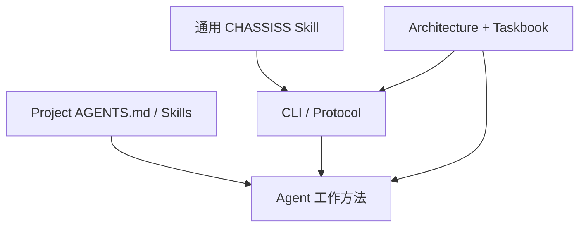

# Skill Runtime Contract

## 1. Skill 定位

通用 CHASSISS Skill 只教 Agent：

```text
如何找到受信 CLI
如何取得 verified Context
如何使用 CLI 管理的 Task worktree
如何调用 available actions
哪些高代价边界不能绕过
```

Skill 不实现协议、不解析 State、不管理 Git、不捆绑二进制、不复制项目
Taskbook。

## 2. 分层



| 层 | 可以定义 | 禁止定义 |
|---|---|---|
| 通用 Skill | CLI 启动、安全边界、Context 使用 | Capability、Task 内容、Git 实现 |
| CLI/Protocol | State、Action、Reducer、签名、Git workflow | 项目领域实现方法 |
| Architecture/Taskbook | 架构资源；本轮 Requirements、Task、Checks | private/local 状态 |
| Project AGENTS/Skills | 编码方法、领域工具、质量建议 | 扩权、绕过 CLI、覆盖协议合同 |

必须强制的架构边界进入 Architecture，当前工作要求进入 Taskbook；只写在
AGENTS/Skill 的内容是工作方法，不是协议合法性条件。

## 3. 安装

Skill 目录不包含 executable binary。

CLI 由用户、管理员、安装器或受控运行环境安装。Skill：

1. 从管理员允许的 PATH/absolute configured path 找到 CLI；
2. 执行 `chassiss version --json`；
3. 确认 CLI 支持 Project 的 exact protocol major；
4. 不接受 Project repository 指定的可执行文件覆盖 trusted CLI。

CLI 与 Skill 不要求同版本发布。Skill 只声明兼容 protocol majors。

## 4. 每次进入 Project

Agent 首次进入目录：

```text
chassiss version --json
chassiss context --json
```

如果目录不是 registered Project，按 CLI remediation 使用 `clone` 或报告。

Context 返回：

- verified/untrusted/offline status；
- Project ID、main checkpoint、Architecture blob 和可选活动 Taskbook blob；
- current identity/Grant；
- available Tasks；
- pending local operations；
- available actions；
- local workflow commands；
- 下一条安全只读命令。

Agent 不自行扫描 `.git` 推断协议状态。

## 5. 开始 Task

```text
chassiss context TASK-001 --json
chassiss task start TASK-001 --json
chassiss work open TASK-001 --json
```

`task start` response 返回 managed worktree absolute path。Agent 后续所有源码
编辑和构建命令必须在该 path 下执行。

Agent 不自行创建 branch、checkout 或 worktree。

## 6. 动态 Context

`chassiss.context/v1` 默认只内联当前 Task 所需的确定性 slice。

如果需要更多知识，Agent使用 Context 返回的 argv，例如：

```text
chassiss taskbook show --requirement REQ-001 --json
chassiss architecture show module:core --json
chassiss architecture requires module:core --transitive --json
chassiss architecture impact schema:state --json
chassiss file show src/core/state/model.go --at main --json
```

Skill 不把整个 Taskbook、所有命令帮助或所有 Architecture View 固定塞入
prompt。

## 7. Git 行为

Agent 可以：

- 在 managed worktree 使用编辑器创建/修改/删除 Task `writes` 内文件；
- 运行 Taskbook 未规定但只读或本地的开发工具；
- 调用 `chassiss work status/diff/log`；
- 调用 `chassiss work commit/restore/remove`；Work Ref 由 `submit` 自动发布。

Agent 禁止直接运行会改变 Git 的命令，包括：

```text
git add
git commit
git branch
git checkout/switch
git worktree
git merge
git rebase
git cherry-pick
git reset
git push
git config
```

Agent 需要 Git 结果时使用 CLI 等价命令。普通只读 Git 不改变协议安全，但
通用 Skill 不推荐或依赖它。

## 8. Work loop

```text
编辑 managed worktree
→ chassiss work status
→ chassiss work diff
→ 项目工具检查
→ chassiss work commit
→ chassiss check
→ chassiss submit
```

`submit` 会重新执行权威 preflight；Agent 不把之前的 Check 输出当作 submit
已成功。

## 9. Review loop

Reviewer：

```text
chassiss context TASK-001 --json
chassiss review TASK-001 --prepare --output <local-file> --json
<阅读 candidate、执行语义复核、填写 Report>
chassiss review TASK-001 --verdict ... --report <file> --json
```

Skill 必须区分：

```text
Check Result      机械命令结果
Review Verdict    Reviewer 语义判断
```

Check pass 不能自动生成 approve。
Reviewer 与 submitter 相同只产生协议 warning；Skill 应把 warning 明确呈现给
Master，不能伪称为独立 Review，也不能擅自拒绝 Master 允许的同主体 Review。

### 9.1 Workflow closure

全部 Tasks terminal 后，Reviewer 填写逐 Task disposition 与 completion
criteria response，再调用 `chassiss taskbook archive`。Skill 不自行运行一份
结果来替代协议检查：archive 命令必须在 exact current main 上重新执行全部
`workflow.checks`，并把 Context/Results 放入 Reviewer 签名 Evidence。
cancelled/superseded 不要求转成 closed，但必须有 Reviewer 的逐项非空确认。

## 10. Context 刷新

Agent 在以下情况重新执行 Context：

- start/submit/review/integrate 等 mutation 后；
- CLI 报 main changed/stale；
- identity/Grant 改变；
- Architecture/Taskbook updated/opened/archived；
- 从另一个 Task/worktree 切换；
- blocked/resumed/request_changes；
- CLI remediation 明确要求。

即使 Agent 未刷新，mutation CLI 仍必须内部 sync/verify，旧 Context 不提供
授权。

## 11. 结构化拒绝

Agent 收到 Error 时：

1. 读取 `code`、`retryable`、`details`；
2. 只执行 `remediation[].argv` 中符合当前用户目标的命令；
3. 不自行修改 State/Architecture/Taskbook/Grant；
4. Capability、Scope、Root、rollback、relevant drift 或 Task conflict 问题
   报告 Master；
5. 不通过换 key、换 remote 或新 Operation ID 绕过。

## 12. 最小安全边界

Skill 必须保留：

- 不直接修改 Git；
- 不直接编辑 State；
- Architecture/Taskbook 只经 draft/validate/diff/open/update/archive；
- 不伪造 Trailer、Semantic Operation、Execution Evidence、Report digest 或
  signature；
- 不提交 private key、secret、local path、cache、Session 或 token；
- 不信任过期/离线 Context 进行 mutation；
- 不推断未授予 Capability；
- 不扩大 Task `writes`/Resource scope；
- 不把 Check pass 当 Review approve；
- relevant/unknown drift 必须重新 Review；
- Root/Grant/rollback 错误必须停止。

`owner apply` 不属于普通 Agent Work loop。只有 Master 明确要求人工接管、且
CLI 报告不存在活动 Agent workflow 时，Skill 才可以导航该命令；不得用它绕过
Task Contract、Review 或 Integration。

## 13. Skill 目录

```text
SKILL.md
references/
  safety.md
  context.md
```

`SKILL.md` 目标不超过约 100 行。`references` 只解释稳定概念，不复制 CLI
command tree、Error code table 或项目 Task 内容；这些由 CLI 动态返回。

## 14. Profile

builder、reviewer、integrator、planner 等 Profile 只属于项目/部署层，用来帮助
Master 组合 Grants。Profile 不进入 State 或 Reducer。

CLI 可以提供规范 `developer` 快捷模板；Skill 必须把它理解为一组 explicit
Capability/Limit 的展开，仍要求 Master 明确选择 Scope，不能把 profile 名称
当作运行时角色或隐藏权限。

协议身份只由：

```text
Actor + Key + current Grant + Capability + Scope
```

决定。
